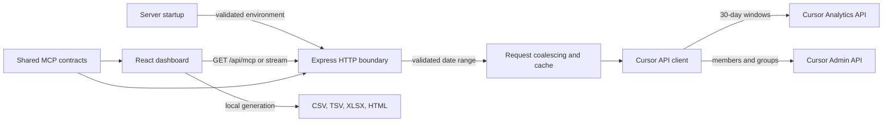
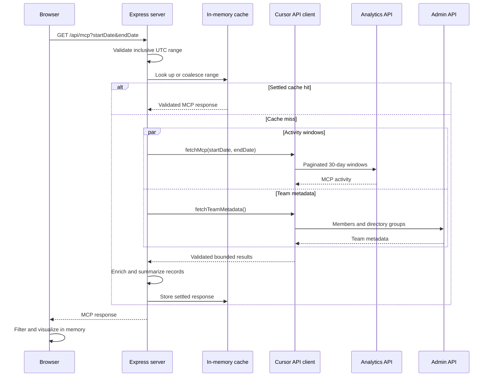

# Cursor MCP Adoption Dashboard

[](../../actions/workflows/ci.yml)
[](LICENSE)
[](https://nodejs.org/)

A self-hosted dashboard for engineering and platform teams exploring Model
Context Protocol adoption across a Cursor Enterprise team.

## Why this project exists

Cursor's APIs expose MCP activity and team metadata, but interpreting adoption
still requires joining, validating, and exploring those datasets. This project
provides a local interface for scoped analysis, relationship discovery, and
privacy-conscious reporting without adding an analytics database.

## Features

- Date, user, MCP, tool, MCP type, and directory-group filters
- Adoption KPIs, daily trends, rankings, and relationship Sankey
- Configurable pivot analysis and user–MCP inventory
- CSV, TSV, XLSX, and self-contained interactive HTML exports
- Bounded API pagination, response sizes, concurrency, retries, and caching
- Loopback-first server with server-side API-key storage

## Quick start

### Prerequisites

- Node.js 20.19 or newer; `.node-version` pins Node.js 24.16.0
- npm 11.13.0
- A Cursor Enterprise team
- A [Cursor Team Admin API key](https://cursor.com/docs/account/teams/admin-api)
  with Analytics API access

### Install and run

```bash
npm ci
npm run dev
```

Open [http://localhost:5173](http://localhost:5173). The loopback-only setup
screen validates the key with Cursor and writes `.env` with owner-only
permissions. The key remains on the server and is never returned to the
browser.

For non-interactive setup options:

```bash
npm run init -- --help
```

Do not pass an API key on the command line, where shell history or process
inspection may expose it. For non-interactive deployments, provide
`CURSOR_API_KEY` through a protected environment file or secret manager.

## Configuration

The server loads `.env` when present. [`.env.example`](.env.example) is the
complete application configuration reference.

| Variable                         | Type             | Default     | Required                  | Purpose                                                                   |
| -------------------------------- | ---------------- | ----------- | ------------------------- | ------------------------------------------------------------------------- |
| `CURSOR_API_KEY`                 | string           | none        | Yes, to load Cursor data  | Cursor Team Admin API key; kept server-side.                              |
| `CURSOR_TEAM_NAME`               | string           | empty       | No                        | Display label because the API returns a team ID, not its display name.    |
| `PORT`                           | integer          | `5173`      | No                        | Vite development UI port.                                                 |
| `SERVER_PORT`                    | integer          | `4173`      | No                        | API and production application port.                                      |
| `BIND_HOST`                      | hostname or IP   | `127.0.0.1` | No                        | Network interface used by development and production servers.             |
| `ALLOW_UNAUTHENTICATED_NETWORK`  | literal `1`      | unset       | For any non-loopback bind | Explicitly acknowledges network exposure; it does not add access control. |
| `INTERNAL_MCP_SERVERS`           | comma-separated  | empty       | No                        | Additional organization-specific MCP labels classified as internal.       |
| `MAX_MCP_RESPONSE_BYTES`         | positive integer | `134217728` | No                        | Maximum estimated analytics response size.                                |
| `MAX_DIRECTORY_GROUPS`           | positive integer | `10000`     | No                        | Maximum directory groups accepted from Cursor.                            |
| `MAX_GROUP_MEMBERSHIPS`          | positive integer | `250000`    | No                        | Maximum directory-group memberships accepted from Cursor.                 |
| `MAX_ENRICHED_GROUP_ASSIGNMENTS` | positive integer | `250000`    | No                        | Maximum group assignments copied onto activity records.                   |

`CHROME_PATH` can select a system Chrome executable for the browser smoke test.
`SMOKE_TEST_DATE` can pin that test's synthetic reference date; neither is
application configuration.

## Usage

### Typical workflow

1. Choose a UTC date preset or custom range. Ranges are inclusive and limited
   to 366 days.
2. Narrow the in-memory dataset by user, MCP, tool, MCP type, directory group,
   or calendar grain.
3. Compare KPIs and trends, inspect user–MCP relationships, or configure a
   pivot.
4. Export the current scope. Treat every export as sensitive employee usage
   data.

The Refresh action bypasses the 12-hour settled-result cache. Repeated refreshes
of the same range within 10 seconds return HTTP 429.

After starting the production server, its liveness endpoint is:

```bash
curl http://localhost:4173/api/health
```

See [docs/usage.md](docs/usage.md) for interaction details and
[docs/api.md](docs/api.md) for the local HTTP contract.

## Architecture

The application has a React/Vite browser runtime and an Express server runtime.
It uses `.env` plus bounded in-memory caches; there is no analytics database.





See [docs/architecture.md](docs/architecture.md) for component boundaries,
configuration states, the in-memory response model, and dependency direction.

## Project structure

- `src/app/` — browser features, filtering, visualization, and exports
- `src/contracts/` — validated MCP contracts shared by browser and server
- `src/server/` — configuration, HTTP lifecycle, caching, and Cursor integration
- `scripts/` — secure interactive setup command
- `tests/` — assembled-system browser smoke test
- `docs/` — architecture, API, usage, and coverage references
- `.github/` — CI and dependency update automation

## Development

Enable the committed pre-commit checks once per clone:

```bash
npm run hooks:install
```

Run the complete repository gate:

```bash
npm run check
```

For UI or assembled-flow changes, install Chromium once and run the smoke test:

```bash
npx playwright install chromium
npm run smoke
```

The test suite uses synthetic data and does not require credentials. See
[docs/coverage-baseline.md](docs/coverage-baseline.md) for measured coverage and
known gaps.

## Deployment

Build and run the Node server:

```bash
npm run build
npm start
```

Open [http://localhost:4173](http://localhost:4173).

To build and run the container locally without credentials:

```bash
docker build -t mcp-adoption-dashboard .
docker run --rm -e ALLOW_UNAUTHENTICATED_NETWORK=1 \
  -p 127.0.0.1:4173:4173 \
  mcp-adoption-dashboard
```

The container listens on its internal network so Docker port publishing works.
The host-side loopback binding keeps the example local.

**This application has no authentication.** `GET /api/mcp` returns named
per-person activity that can include email addresses and directory-group
membership. For shared deployment, use an authenticating reverse proxy and
network controls. `ALLOW_UNAUTHENTICATED_NETWORK=1` is an acknowledgement, not
an access-control mechanism.

## Troubleshooting

- **The API key is rejected:** create a Cursor Team Admin API key with Analytics
  API access, then validate it again through setup.
- **A port is already in use:** set `PORT` and `SERVER_PORT` to unused values.
- **The server refuses to bind:** non-loopback `BIND_HOST` values require
  `ALLOW_UNAUTHENTICATED_NETWORK=1` and external authentication.
- **Interactive HTML export is unavailable:** use a production build; Vite
  development mode does not provide the built single-file shell.
- **The browser smoke test cannot launch Chromium:** run the documented
  Playwright install command or set `CHROME_PATH`.
- **Installation reports an unsupported engine:** use Node.js 20.19 or newer.

## License

[MIT](LICENSE). MIT was chosen to permit broad use, modification, and
distribution with minimal conditions. This independent community project is
not affiliated with or endorsed by Cursor or Anysphere.
