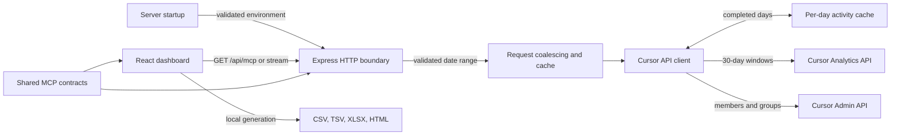
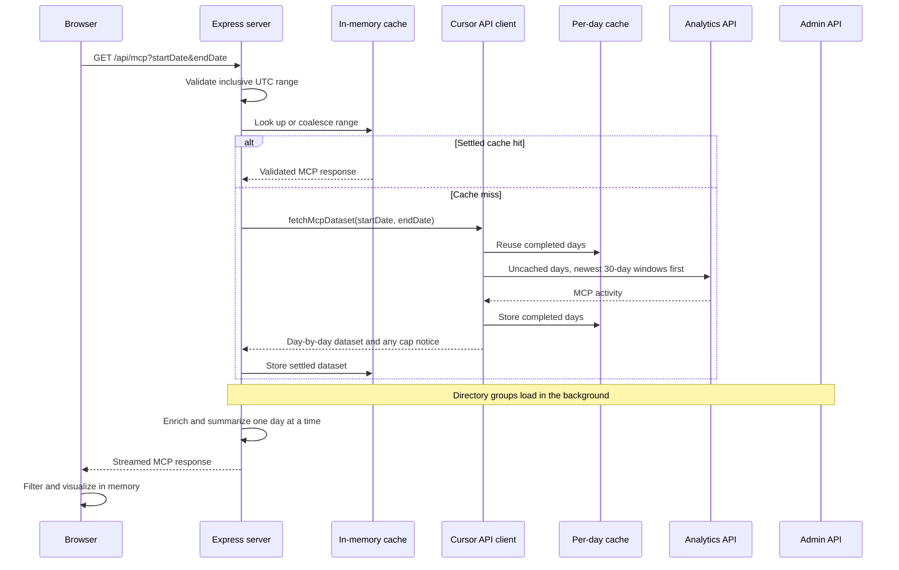

# Cursor MCP Adoption Dashboard

[](../../actions/workflows/ci.yml)
[](LICENSE)
[](https://nodejs.org/)

A self-hosted dashboard for engineering and platform teams exploring Model
Context Protocol adoption across a Cursor Enterprise team.

## Why this project exists

Cursor's APIs expose MCP activity and team metadata, but interpreting adoption
still requires joining, validating, and exploring those datasets. This project
provides a local interface for scoped analysis, relationship discovery, and
privacy-conscious reporting without adding an analytics database.

## Features

- Date, user, MCP, tool, MCP type, and directory-group filters
- Adoption KPIs, daily trends, rankings, and relationship Sankey
- Configurable pivot analysis and user–MCP inventory
- CSV, TSV, XLSX, and self-contained interactive HTML exports
- Bounded API pagination, response sizes, concurrency, retries, and caching
- Loopback-first server with server-side API-key storage

## Quick start

### Prerequisites

- Node.js 20.19 or newer; `.node-version` pins Node.js 24.16.0
- npm 11.13.0
- A Cursor Enterprise team
- A [Cursor Team Admin API key](https://cursor.com/docs/account/teams/admin-api)
  with Analytics API access

### Install and run

```bash
npm ci
npm run dev
```

Open [http://localhost:5173](http://localhost:5173). The loopback-only setup
screen validates the key with Cursor and writes `.env` with owner-only
permissions. The key remains on the server and is never returned to the
browser.

For non-interactive setup options:

```bash
npm run init -- --help
```

Do not pass an API key on the command line, where shell history or process
inspection may expose it. For non-interactive deployments, provide
`CURSOR_API_KEY` through a protected environment file or secret manager.

## Configuration

The server loads `.env` when present. [`.env.example`](.env.example) is the
complete application configuration reference.

| Variable                        | Type                  | Default     | Required                  | Purpose                                                                                                           |
| ------------------------------- | --------------------- | ----------- | ------------------------- | ----------------------------------------------------------------------------------------------------------------- |
| `CURSOR_API_KEY`                | string                | none        | Yes, to load Cursor data  | Cursor Team Admin API key; kept server-side.                                                                      |
| `CURSOR_TEAM_NAME`              | string                | empty       | No                        | Display label because the API returns a team ID, not its display name.                                            |
| `PORT`                          | integer               | `5173`      | No                        | Vite development UI port.                                                                                         |
| `SERVER_PORT`                   | integer               | `4173`      | No                        | API and production application port.                                                                              |
| `BIND_HOST`                     | hostname or IP        | `127.0.0.1` | No                        | Network interface used by development and production servers.                                                     |
| `ALLOW_UNAUTHENTICATED_NETWORK` | literal `1`           | unset       | For any non-loopback bind | Explicitly acknowledges network exposure; it does not add access control.                                         |
| `INTERNAL_MCP_SERVERS`          | comma-separated       | empty       | No                        | Additional organization-specific MCP labels classified as internal.                                               |
| `DEFAULT_RANGE_DAYS`            | integer from 1 to 366 | `90`        | No                        | Range in days pre-selected at startup when no range is remembered. An invalid value logs a warning and uses `90`. |

### Optional caps and timeouts

Every cap below is optional. Defaults are high enough that they are not reached
in normal use; set a lower value to bound memory, disk, or request time. When a
cap is reached the dashboard keeps working: it shows the data loaded so far,
newest days first, with a notice that names the setting to raise and the
shorter range that would be complete.

| Variable                         | Type                 | Default               | Purpose                                                                                   |
| -------------------------------- | -------------------- | --------------------- | ----------------------------------------------------------------------------------------- |
| `MAX_MCP_RECORDS`                | positive integer     | `100000000`           | Maximum activity rows processed for one date range, including zero-usage rows.            |
| `MAX_MCP_RESPONSE_BYTES`         | positive integer     | `25600000000`         | Maximum serialized size of the activity rows in one result (about 256 bytes per row).     |
| `MAX_API_PAGE_BYTES`             | positive integer     | `67108864`            | Maximum size of one Cursor API response page.                                             |
| `MAX_DIRECTORY_GROUPS`           | positive integer     | `1000000`             | Maximum directory groups loaded from Cursor.                                              |
| `MAX_GROUP_MEMBERSHIPS`          | positive integer     | `100000000`           | Maximum directory-group memberships loaded from Cursor.                                   |
| `MAX_ENRICHED_GROUP_ASSIGNMENTS` | positive integer     | `1000000000`          | Maximum group names attached to activity rows in one result; the newest rows keep groups. |
| `MAX_CACHED_RECORDS`             | positive integer     | `100000000`           | Maximum activity rows held across settled results in the 12-hour result cache.            |
| `VALIDATION_TIMEOUT_MS`          | positive integer     | `300000`              | Time allowed for the single request that validates an API key.                            |
| `ANALYTICS_TIMEOUT_MS`           | positive integer     | `7200000`             | Time allowed to load one date range; days loaded before it passes are shown.              |
| `DIRECTORY_LOAD_TIMEOUT_MS`      | positive integer     | `86400000`            | Time allowed for the background directory load; groups loaded before it passes are kept.  |
| `MCP_CACHE_DIR`                  | path                 | `.cache/mcp-activity` | Directory for the per-day activity cache, relative to the working directory.              |
| `MCP_CACHE_MAX_BYTES`            | positive integer     | `25600000000`         | Maximum size of the per-day activity cache; the oldest days are evicted first.            |
| `MCP_CACHE_REFETCH_DAYS`         | non-negative integer | `2`                   | Days before today that are always refetched; today is always refetched.                   |

Timeouts cannot exceed `2147483647` milliseconds.

`CHROME_PATH` can select a system Chrome executable for the browser smoke test.
`SMOKE_TEST_DATE` can pin that test's synthetic reference date; neither is
application configuration.

## Usage

### Typical workflow

1. Pick a starting range: a 7, 30, 90, 180, or 365-day preset, or a custom
   UTC range. Ranges are inclusive and limited to 366 days. Later, switch
   ranges from the dashboard header.
2. Narrow the in-memory dataset by user, MCP, tool, MCP type, directory group,
   or calendar grain.
3. Compare KPIs and trends, inspect user–MCP relationships, or configure a
   pivot.
4. Export the current scope. Treat every export as sensitive employee usage
   data.

The Refresh action bypasses the 12-hour settled-result cache. Repeated refreshes
of the same range within 10 seconds return HTTP 429. Completed days older than
the refetch window are kept in the per-day activity cache, so a refresh or a
later range fetches only the days that are not cached yet.

At startup the dashboard shows which presets the per-day cache already holds
and pre-selects the largest fully cached one, or `DEFAULT_RANGE_DAYS` when
nothing is cached. The choice is remembered in `startup-range.json` inside
`MCP_CACHE_DIR` (and in the browser when the server cannot store it). When the
remembered range already has cached days, it loads at once; **Change range** on
the loading screen returns to the picker. The loading screen and the notice
shown while a reload runs report days from the cache and fetched, the current
30-day window, rows loaded, elapsed time, an estimate of the time remaining,
and retry or slow states.

Directory groups load in the background after the API key is validated. The
dashboard opens without waiting; names, roles, and group filters appear when
the directory finishes loading.

After starting the production server, its liveness endpoint is:

```bash
curl http://localhost:4173/api/health
```

See [docs/usage.md](docs/usage.md) for interaction details and
[docs/api.md](docs/api.md) for the local HTTP contract.

## Architecture

The application has a React/Vite browser runtime and an Express server runtime.
It uses `.env`, bounded in-memory caches, and a size-capped per-day activity
cache on disk (`MCP_CACHE_DIR`); there is no analytics database.


```mermaid
flowchart LR
  Startup["Server startup"] -->|"validated environment"| HTTP["Express HTTP boundary"]
  Browser["React dashboard"] -->|"GET /api/mcp or stream"| HTTP
  HTTP -->|"validated date range"| Coordinator["Request coalescing and cache"]
  Coordinator --> Client["Cursor API client"]
  Client <-->|"completed days"| DayCache["Per-day activity cache"]
  Client -->|"30-day windows"| Analytics["Cursor Analytics API"]
  Client -->|"members and groups"| Admin["Cursor Admin API"]
  Contracts["Shared MCP contracts"] --> Browser
  Contracts --> HTTP
  Browser -->|"local generation"| Exports["CSV, TSV, XLSX, HTML"]
```


```mermaid
sequenceDiagram
  participant Browser
  participant HTTP as Express server
  participant Cache as In-memory cache
  participant Client as Cursor API client
  participant Days as Per-day cache
  participant Analytics as Analytics API
  participant Admin as Admin API

  Browser->>HTTP: GET /api/mcp?startDate&endDate
  HTTP->>HTTP: Validate inclusive UTC range
  HTTP->>Cache: Look up or coalesce range
  alt Settled cache hit
    Cache-->>HTTP: Validated MCP response
  else Cache miss
    HTTP->>Client: fetchMcpDataset(startDate, endDate)
    Client->>Days: Reuse completed days
    Client->>Analytics: Uncached days, newest 30-day windows first
    Analytics-->>Client: MCP activity
    Client->>Days: Store completed days
    Client-->>HTTP: Day-by-day dataset and any cap notice
    HTTP->>Cache: Store settled dataset
  end
  Note over HTTP,Admin: Directory groups load in the background
  HTTP->>HTTP: Enrich and summarize one day at a time
  HTTP-->>Browser: Streamed MCP response
  Browser->>Browser: Filter and visualize in memory
```

See [docs/architecture.md](docs/architecture.md) for component boundaries,
configuration states, the in-memory response model, and dependency direction.

## Project structure

- `src/app/` — browser features, filtering, visualization, and exports
- `src/contracts/` — validated MCP contracts shared by browser and server
- `src/server/` — configuration, HTTP lifecycle, caching, and Cursor integration
- `scripts/` — secure interactive setup command
- `tests/` — assembled-system browser smoke test
- `docs/` — architecture, API, usage, and coverage references
- `.github/` — CI and dependency update automation

## Development

Enable the committed pre-commit checks once per clone:

```bash
npm run hooks:install
```

Run the complete repository gate:

```bash
npm run check
```

For UI or assembled-flow changes, install Chromium once and run the smoke test:

```bash
npx playwright install chromium
npm run smoke
```

The test suite uses synthetic data and does not require credentials. See
[docs/coverage-baseline.md](docs/coverage-baseline.md) for measured coverage and
known gaps.

## Deployment

Build and run the Node server:

```bash
npm run build
npm start
```

Open [http://localhost:4173](http://localhost:4173).

To build and run the container locally without credentials:

```bash
docker build -t mcp-adoption-dashboard .
docker run --rm -e ALLOW_UNAUTHENTICATED_NETWORK=1 \
  -p 127.0.0.1:4173:4173 \
  mcp-adoption-dashboard
```

The container listens on its internal network so Docker port publishing works.
The host-side loopback binding keeps the example local.

**This application has no authentication.** `GET /api/mcp` returns named
per-person activity that can include email addresses and directory-group
membership. For shared deployment, use an authenticating reverse proxy and
network controls. `ALLOW_UNAUTHENTICATED_NETWORK=1` is an acknowledgement, not
an access-control mechanism.

## Troubleshooting

- **The API key is rejected:** create a Cursor Team Admin API key with Analytics
  API access, then validate it again through setup.
- **A port is already in use:** set `PORT` and `SERVER_PORT` to unused values.
- **The server refuses to bind:** non-loopback `BIND_HOST` values require
  `ALLOW_UNAUTHENTICATED_NETWORK=1` and external authentication.
- **Interactive HTML export is unavailable:** use a production build; Vite
  development mode does not provide the built single-file shell.
- **The browser smoke test cannot launch Chromium:** run the documented
  Playwright install command or set `CHROME_PATH`.
- **Installation reports an unsupported engine:** use Node.js 20.19 or newer.
- **The dashboard shows partial data:** the notice names the cap that was
  reached. Raise that setting, or choose the shorter range the notice suggests.
- **The activity cache should be rebuilt:** stop the server and delete
  `MCP_CACHE_DIR`. Changing the API key clears the cached days automatically.
  Deleting the directory also forgets the remembered startup range.

## License

[MIT](LICENSE). MIT was chosen to permit broad use, modification, and
distribution with minimal conditions. This independent community project is
not affiliated with or endorsed by Cursor or Anysphere.
