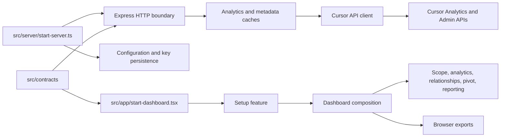
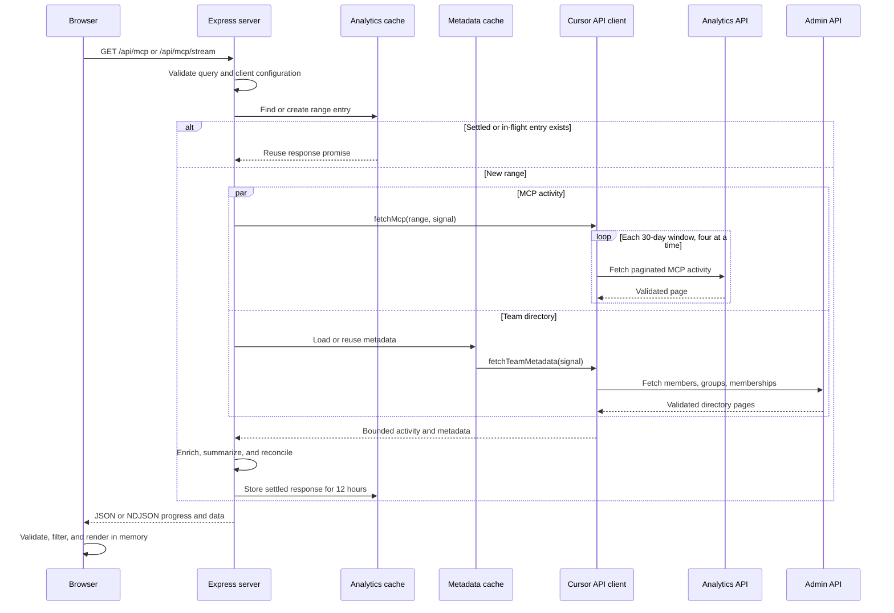
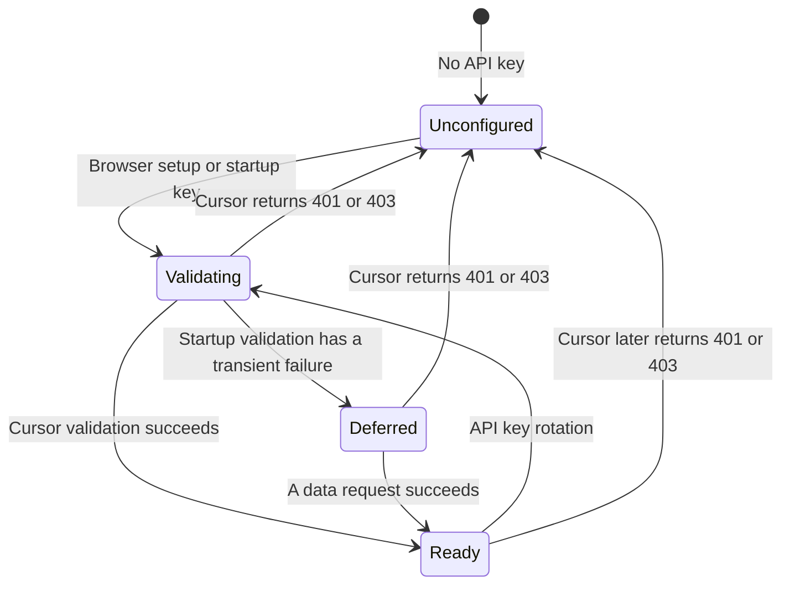
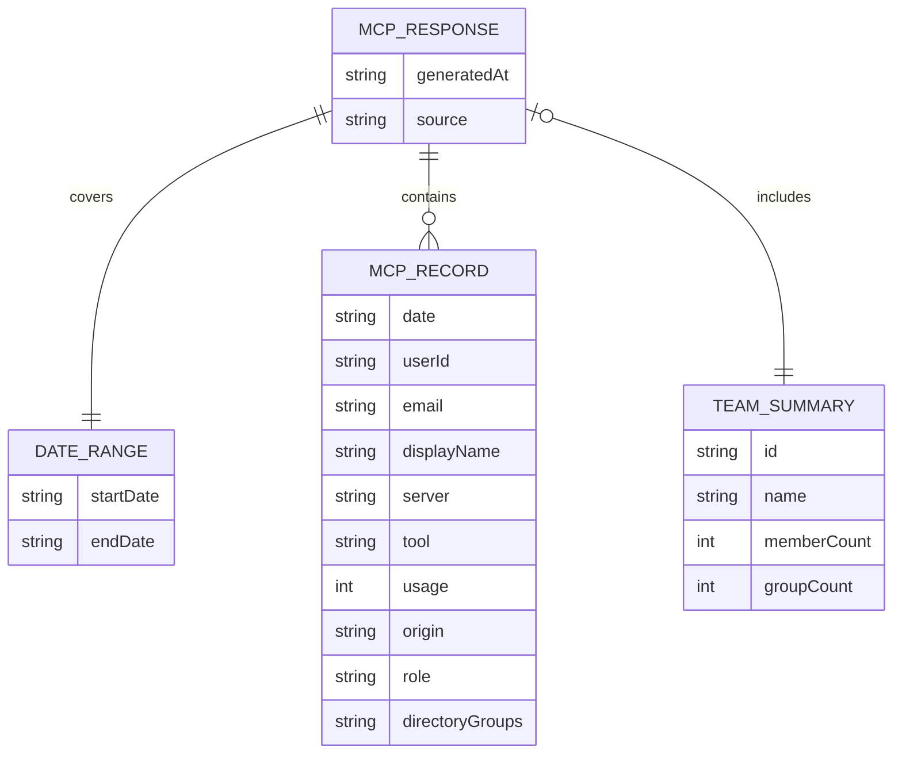

# Architecture

The application has a browser runtime and a server runtime. It persists only
the API key and operator configuration in `.env`; analytics and team metadata
are held in bounded process-local caches. There is no database.

## Component boundaries

Browser behavior belongs in `src/app/<feature>/`. Server behavior belongs in
`src/server/<domain>/`. Both runtimes may import `src/contracts/`, but they do
not import each other's implementation. ESLint enforces those directions.
Focused tests are colocated with their owners; `tests/browser-smoke.test.ts`
exercises the assembled application.

No circular imports were found in the source, script, or test graph.

## Primary request flow

Matching requests share one promise. The server aborts upstream work when all
subscribers disconnect, a newer API key supersedes the client, the five-minute
deadline expires, or the process shuts down. The Refresh action invalidates
settled data for one range and is rate-limited to once per 10 seconds.

## Configuration lifecycle

Browser setup and key rotation are enabled only when the process binds to a
loopback interface. A non-loopback bind requires the explicit
`ALLOW_UNAUTHENTICATED_NETWORK=1` acknowledgement and still needs an
authenticating reverse proxy.

## In-memory response model

The ER diagram describes the validated wire contract, not database tables.

Each record represents positive usage for one user, UTC date, MCP label, and
tool. `src/contracts/mcp-response.ts` strips unknown fields, validates every
known field, verifies that dates fall inside the inclusive range, and
recomputes the summary before browser code accepts a response.

## Build and deployment

Vite builds the React application into one self-contained `dist/index.html`.
TypeScript compiles the NodeNext server to `dist-server/`; `npm start` serves
the API and built single-page application from the same Express process.

The Dockerfile repeats that build in a pinned Node.js image, installs only
runtime dependencies in the final stage, runs as the unprivileged `node` user,
and checks `/api/health`. CI runs the repository gate on supported Node.js 20,
22, and 24 releases, then separately verifies the browser flow and container.

## External integrations

- Cursor Analytics API supplies per-user MCP activity. Date ranges are split
  into 30-day windows, fetched with bounded concurrency, paginated, and merged.
- Cursor Admin API supplies team members, directory groups, and memberships.
  Requests are client-throttled and results are cached.
- No telemetry, database, object store, or third-party authentication service
  is used.

Upstream payloads are untrusted. The client limits body bytes, page count,
records, directory groups, memberships, text lengths, retries, and time. The
HTTP boundary maps upstream details to sanitized errors and never returns the
API key.
