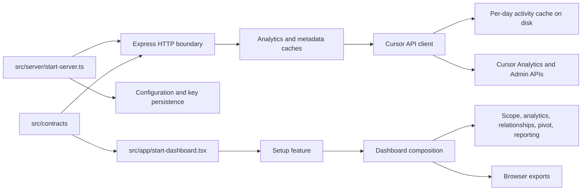
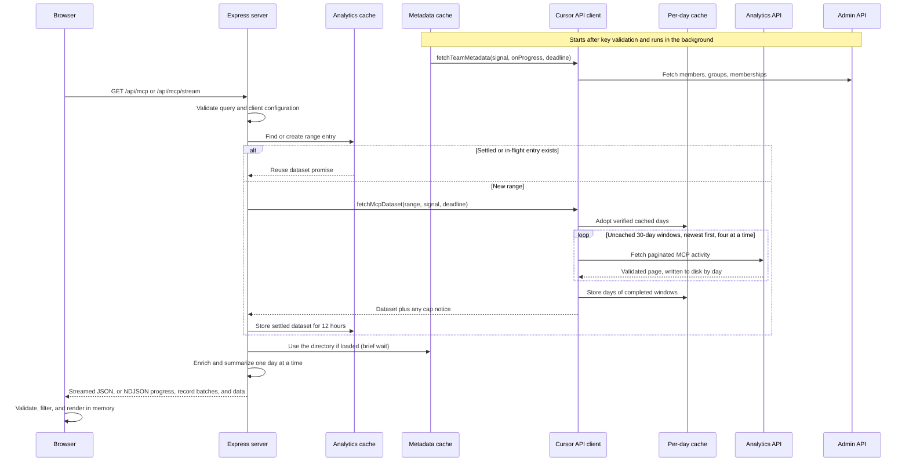
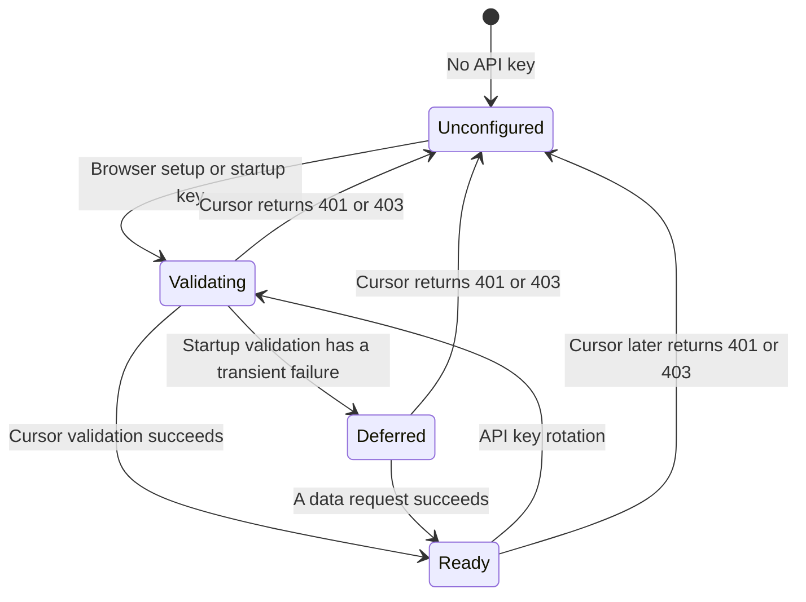
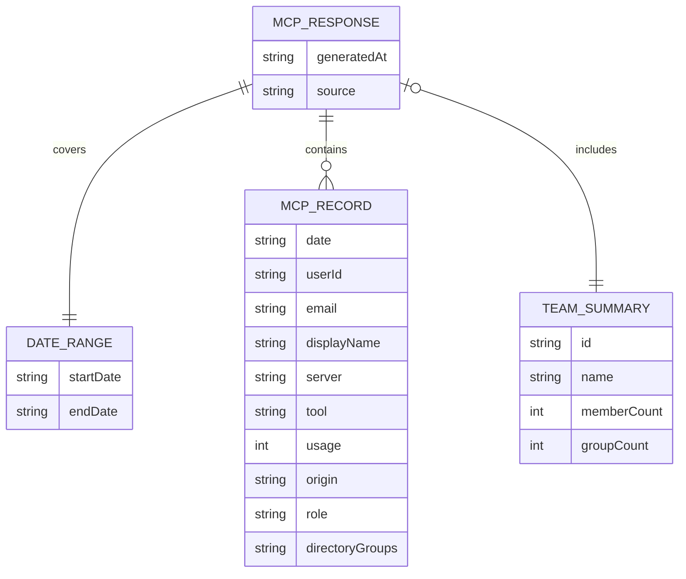

# Architecture

The application has a browser runtime and a server runtime. It persists the API
key and operator configuration in `.env` and completed days of MCP activity in a
size-capped per-day cache on disk. Settled results and team metadata are held in
bounded process-local caches. There is no database.

## Component boundaries

```mermaid
flowchart LR
  Entry["src/app/start-dashboard.tsx"] --> Setup["Setup feature"]
  Setup --> Dashboard["Dashboard composition"]
  Dashboard --> Features["Scope, analytics, relationships, pivot, reporting"]
  Dashboard --> Exports["Browser exports"]

  Server["src/server/start-server.ts"] --> Config["Configuration and key persistence"]
  Server --> HTTP["Express HTTP boundary"]
  HTTP --> Cache["Analytics and metadata caches"]
  Cache --> Cursor["Cursor API client"]
  Cursor --> DayCache["Per-day activity cache on disk"]
  Cursor --> External["Cursor Analytics and Admin APIs"]

  Contracts["src/contracts"] --> Entry
  Contracts --> HTTP
```

Browser behavior belongs in `src/app/<feature>/`. Server behavior belongs in
`src/server/<domain>/`. Both runtimes may import `src/contracts/`, but they do
not import each other's implementation. ESLint enforces those directions.
Focused tests are colocated with their owners; `tests/browser-smoke.test.ts`
exercises the assembled application.

No circular imports were found in the source, script, or test graph.

## Primary request flow

```mermaid
sequenceDiagram
  participant Browser
  participant HTTP as Express server
  participant Cache as Analytics cache
  participant Metadata as Metadata cache
  participant Client as Cursor API client
  participant Days as Per-day cache
  participant Analytics as Analytics API
  participant Admin as Admin API

  Note over Metadata,Admin: Starts after key validation and runs in the background
  Metadata->>Client: fetchTeamMetadata(signal, onProgress, deadline)
  Client->>Admin: Fetch members, groups, memberships
  Browser->>HTTP: GET /api/mcp or /api/mcp/stream
  HTTP->>HTTP: Validate query and client configuration
  HTTP->>Cache: Find or create range entry
  alt Settled or in-flight entry exists
    Cache-->>HTTP: Reuse dataset promise
  else New range
    HTTP->>Client: fetchMcpDataset(range, signal, deadline)
    Client->>Days: Adopt verified cached days
    loop Uncached 30-day windows, newest first, four at a time
      Client->>Analytics: Fetch paginated MCP activity
      Analytics-->>Client: Validated page, written to disk by day
    end
    Client->>Days: Store days of completed windows
    Client-->>HTTP: Dataset plus any cap notice
    HTTP->>Cache: Store settled dataset for 12 hours
  end
  HTTP->>Metadata: Use the directory if loaded (brief wait)
  HTTP->>HTTP: Enrich and summarize one day at a time
  HTTP-->>Browser: Streamed JSON, or NDJSON progress, record batches, and data
  Browser->>Browser: Validate, filter, and render in memory
```

Matching requests share one promise. The server aborts upstream work when all
subscribers disconnect, a newer API key supersedes the client, or the process
shuts down. When the analytics deadline (`ANALYTICS_TIMEOUT_MS`) passes, the
days loaded so far are returned with a notice. The Refresh action invalidates
settled data for one range and is rate-limited to once per 10 seconds.

## Caps and partial results

Every cap is optional and defaults high enough that it is not reached in
normal use. Reaching one never fails the request:

- Activity windows are collected newest first. A window that reaches
  `MAX_MCP_RECORDS`, `MAX_MCP_RESPONSE_BYTES`, `MAX_API_PAGE_BYTES`, or the
  analytics deadline stops; older windows are abandoned and newer windows
  finish. The result includes every complete day from the newest end, then as
  many of the remaining newest days as fit, and a `LIMIT_REACHED` notice with
  the setting to raise and the first date of the complete range
  (`completeFrom`).
- Directory caps (`MAX_DIRECTORY_GROUPS`, `MAX_GROUP_MEMBERSHIPS`, page size,
  and `DIRECTORY_LOAD_TIMEOUT_MS`) keep the groups loaded so far and attach a
  notice. Activity totals are not affected.
- `MAX_ENRICHED_GROUP_ASSIGNMENTS` attaches groups to the newest records first.
- Partial results are cached like complete results, and the server keeps
  serving other requests.

## Memory model

Activity is never held as one array on the server. Pages are validated and
appended to per-day files in a per-request run directory; each day is sorted
and checked for duplicates when its window completes. Responses read one day
at a time, enrich and summarize incrementally, and write JSON or NDJSON in
batches of 5,000 records with backpressure. Server memory is bounded by one
page and one day of records rather than by the size of the range. The browser
still holds the result it renders, so very large ranges are limited by browser
memory.

## Per-day activity cache

- Location: `MCP_CACHE_DIR` (default `.cache/mcp-activity`), created with
  owner-only permissions. `days/<date>.ndjson` holds one verified file per day
  (a header with record count, byte count, and SHA-256, then one record per
  line). `runs/` holds per-request working files, removed when the result is
  released and on startup.
- Population: a day is stored only after every page of its 30-day window has
  been read without reaching a cap, so partial days are never cached.
- Refetch window: today and the previous `MCP_CACHE_REFETCH_DAYS` days
  (default 2) are always fetched again and never stored.
- Reuse: a request adopts cached days and fetches only the uncached runs of
  days, split into 30-day windows.
- Invalidation: `manifest.json` stores a SHA-256 fingerprint of the API key;
  activating a different key deletes every cached day. A file that fails
  verification is deleted and that day is fetched again.
- Size cap: when the files exceed `MCP_CACHE_MAX_BYTES`, the oldest days are
  evicted first. Files linked into an active result stay readable until it is
  released.
- If the directory cannot be created, the dashboard runs without the per-day
  cache.

## Configuration lifecycle

```mermaid
stateDiagram-v2
  [*] --> Unconfigured: No API key
  Unconfigured --> Validating: Browser setup or startup key
  Validating --> Ready: Cursor validation succeeds
  Validating --> Unconfigured: Cursor returns 401 or 403
  Validating --> Deferred: Startup validation has a transient failure
  Deferred --> Ready: A data request succeeds
  Deferred --> Unconfigured: Cursor returns 401 or 403
  Ready --> Validating: API key rotation
  Ready --> Unconfigured: Cursor later returns 401 or 403
```

Browser setup and key rotation are enabled only when the process binds to a
loopback interface. A non-loopback bind requires the explicit
`ALLOW_UNAUTHENTICATED_NETWORK=1` acknowledgement and still needs an
authenticating reverse proxy.

## In-memory response model

The ER diagram describes the validated wire contract, not database tables.

```mermaid
erDiagram
  MCP_RESPONSE ||--|| DATE_RANGE : covers
  MCP_RESPONSE ||--o{ MCP_RECORD : contains
  MCP_RESPONSE o|--|| TEAM_SUMMARY : includes

  MCP_RESPONSE {
    string generatedAt
    string source
  }
  DATE_RANGE {
    string startDate
    string endDate
  }
  MCP_RECORD {
    string date
    string userId
    string email
    string displayName
    string server
    string tool
    int usage
    string origin
    string role
    string directoryGroups
  }
  TEAM_SUMMARY {
    string id
    string name
    int memberCount
    int groupCount
  }
```

Each record represents positive usage for one user, UTC date, MCP label, and
tool. `src/contracts/mcp-response.ts` strips unknown fields, validates every
known field, verifies that dates fall inside the inclusive range, and
recomputes the summary before browser code accepts a response.

## Build and deployment

Vite builds the React application into one self-contained `dist/index.html`.
TypeScript compiles the NodeNext server to `dist-server/`; `npm start` serves
the API and built single-page application from the same Express process.

The Dockerfile repeats that build in a pinned Node.js image, installs only
runtime dependencies in the final stage, runs as the unprivileged `node` user,
and checks `/api/health`. CI runs the repository gate on supported Node.js 20,
22, and 24 releases, then separately verifies the browser flow and container.

## External integrations

- Cursor Analytics API supplies per-user MCP activity. Uncached days are split
  into 30-day windows, fetched newest first with bounded concurrency, and
  paginated. An API key is validated with one single-row request.
- Cursor Admin API supplies team members, directory groups, and memberships.
  They load in the background with progress reporting; requests are
  client-throttled and results are cached.
- No telemetry, database, object store, or third-party authentication service
  is used.

Upstream payloads are untrusted. The client validates page structure, text
lengths, and retries, and caps page bytes, records, response bytes, directory
groups, memberships, and time. The
HTTP boundary maps upstream details to sanitized errors and never returns the
API key.
